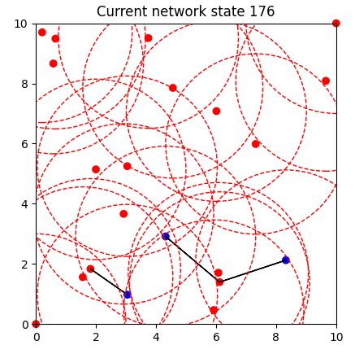

# MAC and Routing Protocol Simulator
Implemented using python and matplotlib. The simulator uses discrete time, with one central clock being used by every node. Both protocols, ALOHA and RTSCTS, are implemented as a state machine. The simulator takes propagation times and processing times, caused by sending and receiving packets, into account.

Propagation time, the time it takes for a message to be transmitted, is measured in clock ticks. Processing time is the same for sending and receiving, it is equal to the message length. Propagation speed is one distance unit per clock tick.

The pathloss model used is a simple geometric model. As long as a node is in the radius of another node, the propability of a successfull transfer in a scenario without collisions is 1. 

On top of the MAC protocol DSDV routing is implemented.

# Usage
To run:
```
python3 main.py
```

To setup nodes and a sending schedule, refer to `scenarious_routing.py`. This file creates a demo scenario
```
Routing_1_aloha = Scenario(
    "Routing_1_aloha",
    0.25,
    3,
    [RTSCTSNode(i, 0.25, 3, np.random.uniform(0, 10), np.random.uniform(0, 10)) for i in range(1, 20)] +
    [RTSCTSNode(0, 0.25, 3, 0, 0),  # source
     RTSCTSNode(100, 0.25, 3, 10, 10)],  # sink

    [
        PlannedTransmission(2, HighLevelMessage(100, "Hello message", 5), 0)
    ]
)
```
with one source and one sink node on opposite borders of the topology and 20 randomly located nodes inbetween. The source sends one message at simulation time 2 to the sink. RTSCTS is used instead of ALOHA.


